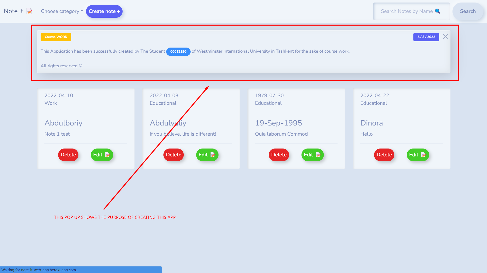

# Note It 📝

#### This online application is meant to capture a note with many capabilities 

-------------------------------------------
YOU CAN DO FOLLOWING ACTIONS BELOW 🔽
                                              
##### 1- ADD an author name,
##### 2- ADD A creation date,
##### 3- ADD category

#### The user interface allows you to:
##### 4- REMOVE
##### 5- CREATE
##### 6- EDIT notes.
##### 6- SEARCH notes.
##### 6- SORT notes.


## Installation

Install Note It 📝 with npm

```bash
  cd my-project
  npm install 
  node server.js || nodemon server.js 
```
You MUST INSTALL MONGODB on your PC in order to execute the (Note It 📝) web application.

IF YOU ARE NOT ABLE TO INSTALL MONGODB ON YOUR MACHINE, YOU CAN USE THIS HOSTED LINK TO RUN IT ONLINE, YOU WILL NOT HAVE A PROBLEM TO RUN IT ONLINE 

(IT'S DEPLOYED ON HEROKU FREE PACK, IT TAKES 10-15 SECONDS TO RUN IT FIRST TIME)

Link is https://abdulboriyweb2.herokuapp.com


## Screenshots
#SCREENSHOT  #1



## Author

- [@MrHumble21](https://github.com/MrHumble21)


## Dependecies List:

    "body-parser": "^1.19.2"
    
    "dotenv": "^16.0.0"

    "ejs": "^3.1.6"

    "express": "^4.17.3"

    "mongodb": "^4.4.1"

    "mongoose": "^6.2.4"

    "uuid": "^8.3.2"


## 🔗 Links
Git hub repo link -- https://github.com/MrHumble21/note_appCW2

Hosted link -- https://abdulboriyweb2.herokuapp.com
## License

[ISC](https://choosealicense.com/licenses/ISC/)

